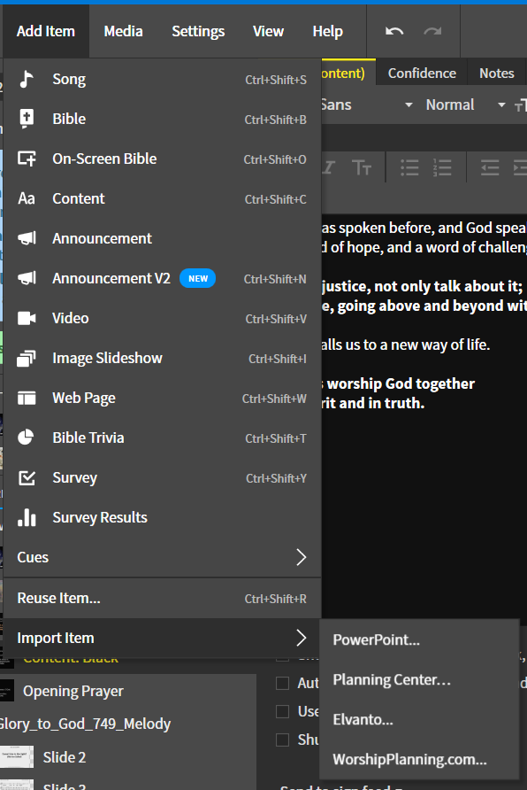
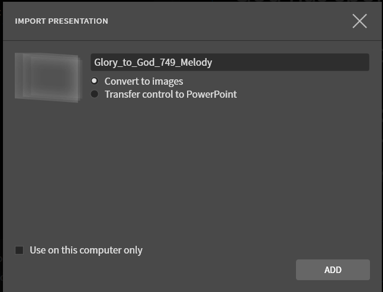
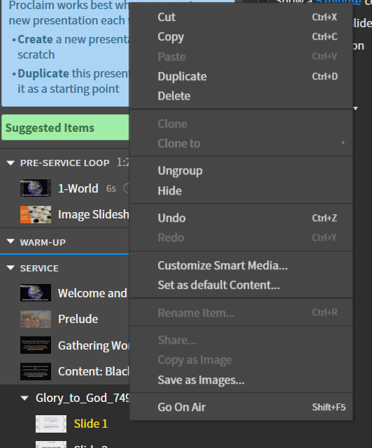

# Adding Hymns

## 1. Import Item
 Add a new hymn by doing the following:

  ```
  Add Item --> Import Item --> PowerPoint...
  ```

On a Mac it will likely show ```Keynote/PowerPoint...```

 
 

## 2. Find Hymn in GTG Folder
 Find the hymn in the Glory to God folder that you want to import. The GTG folder is laid out in the following template:
 
   ```
   GTG:
    --> Hymns for Projection:
      --> Hymns by Number:
         --> Harmony PDF
         --> Harmony PPT
         --> Lyrics Only PDF
         --> Lyrics Only PPT
         --> Melody PDF
         --> Melody PPT
    --> Instructions and Permissions:
      --> Copyright Information
   ```
 
 You want to select the Melody PPT to import into Proclaim.

## 3. Import
 After you find the hymn you want, make sure of the following settings:

 - ```Convert to images``` is toggled
 - The box for ```Use on this computer only``` is not checked.
  
  Then, click ```add```.

 

## 4. Delete Slides
 If there is a copyright slide at the beginning, or verses that are not being sung, delete them from the slideshow. 

 Opposite click on the slide you want to delete and click ```Delete``` in the dropdown menu.

 