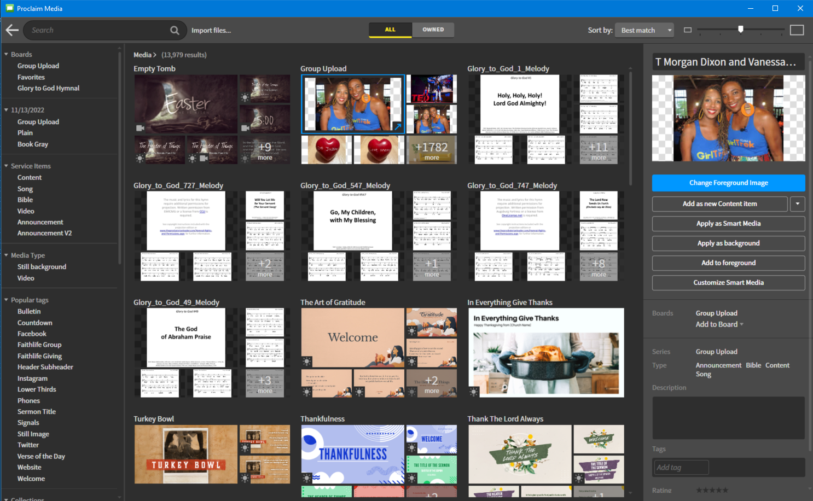

# Adding Images to Pre- and Post-Service loop

The image slideshow in the pre- and post-service loops are linked together, so when you edit one of them, the opther will update as well.

---

## 1. Navigate to Image Slideshow
 Navigate to the ```Image Slideshow``` in the ```Pre-Service Loop```.
  
 

## 2. Import or Browse for Image
 Add an image by clicking the ```Choose Image``` button above the existing images on the left side.

 

 You can either browse for an image in the image library by selecting ```Browse Media``` or import an image from your computer by selecting ```Import...``` in the drowdown.

### A. Browse Image Library
 You can browse the image library by selecting ```Browse Media```. This will bring up the media library. Look under the ```Group Upload``` for images. Most all the other options require a subscription to use. These are the images that we have uploaded. Click the ```+1782 more``` (or however many the number is at that point) in the bottom right corner of the group upload section or the ```Group Upload``` text at the top of that section to view all the uploaded images.
    
 