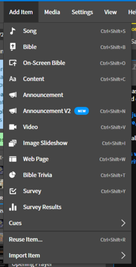
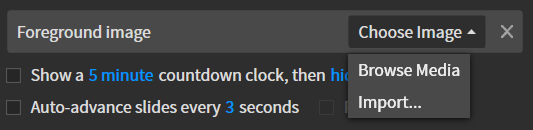
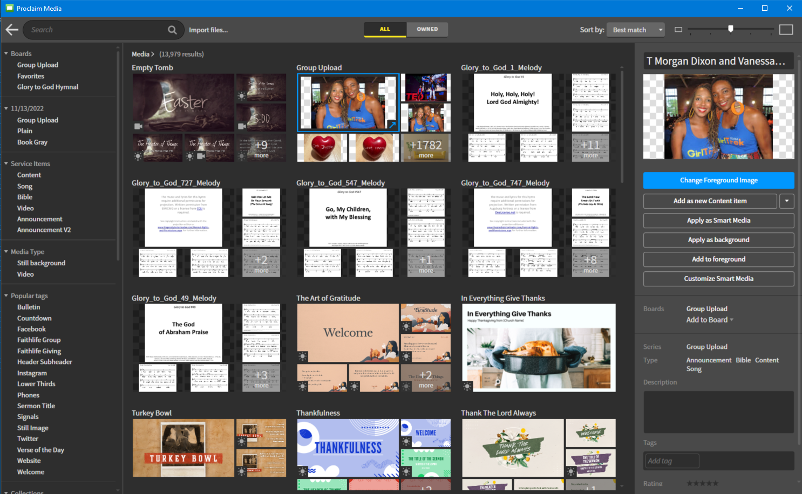

# Adding Images to Service Section

## 1. Add Content Item
 Add a new content item by doing the following:

  ```
  Add Item --> Content
  ```
  
 
 

## 2. Add Foreground Image
 Add a foreground image by pressing the image button in the topbar above the content:

 

## 3. Import or Browse for Image
 Now choose an image by clicking the ```Choose Image``` button on the left side.

 

 You can either browse for an image in the image library or import an image from your computer.

### Browse Image Library
 You can browse the image library by selecting ```Browse Media```. This will bring up the media library. Look under the ```Group Upload``` for images. Most all the other options require a subscription to use. These are the images that we have uploaded. Click the ```+1782 more``` (or however many the number is at that point) in the bottom right corner of the group upload section to view all the uploaded images.
    
 

## 4. Adding More Images or Text to Slide
 Not that you have added an image to the slide, you can resize and move the image by clicking on it and moving the sides around, add more images and text to the slide, and more. All these different options show up on the bar above the content.