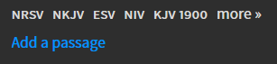

# Adding Scripture

## 1. Add On-Screen Bible
 Add a new On-Screen Bible by doing the following:

  ```
  Add Item --> On-Screen Bible
  ```
  
 
 

## 2. Add a Passage
 Add a new passage by clicking the ```Add a passage``` text. 

 

## 3. Enter Readings
 Enter the readings into the box. For readings that span multiple chapters, you will have to break up the chapters. Press the ```->``` to the right to add the scripture reading to the content.

 

## 4. Change Bible as Needed
 Depending on which bible the reading comes from, you might need to change the bibile you are using. Above the passages entering it gives you a list of bibles, select it from there.

 

 The bible will tell you at the bottom of the screen in the preview what version you are using. 

 