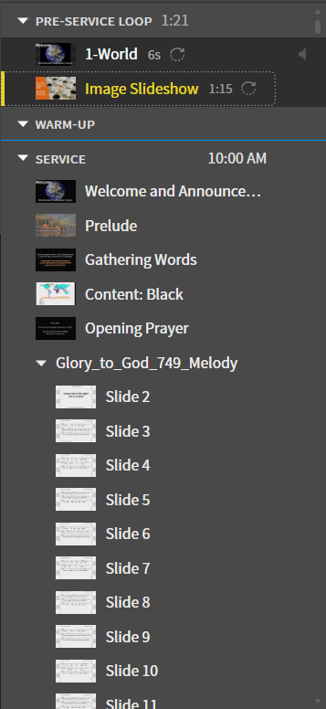

# Deleting Images from Pre- and Post-Service loop

The image slideshow in the pre- and post-service loops are linked together, so when you edit one of them, the opther will update as well.

---

## 1. Navigate to Image Slideshow
 Navigate to the ```Image Slideshow``` in the ```Pre-Service Loop```
  
 

## 2. Delete Image
 Delete an image by clicking the ```x``` button to the right of an existing image on the left side.

 