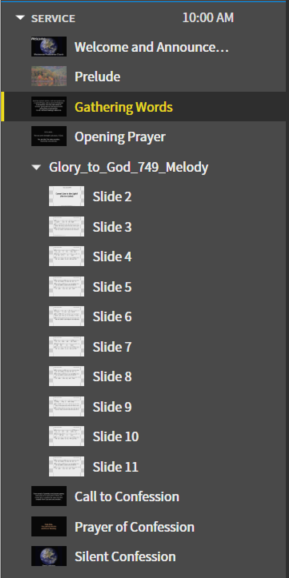

# Editing Scripture

## 1. Navigate to Existing Scripture Reading
 To edit the previous scripture reading navigate to the scripture reading. It will be named whatever the current scripture reading entered is.
 
 

## 2. Delete Previous Readings
 Delete the previous readings by selecting the ```x``` to the right of them

 

## 3. Add a Passage
 Now that the previous readings have been deleted, add a new passage by clicking the ```Add a passage``` text. 

 

## 4. Enter Readings
 Enter the readings into the box. For readings that span multiple chapters, you will have to break up the chapters. Press the ```->``` button to the right to add the scripture reading to the content.

 

## 5. Change Bible as Needed
 Depending on which bible the reading comes from, you might need to change the bibile you are using. Above the passages entering it gives you a list of bibles, select it from there.

 

 The bible will tell you at the bottom of the screen in the preview what version you are using. 

 
