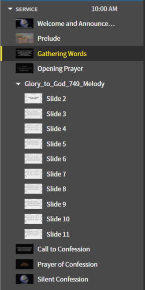
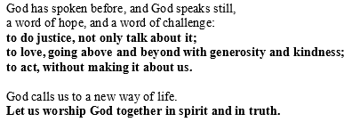
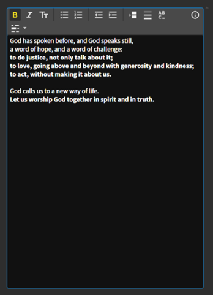
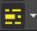
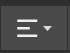
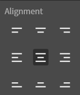
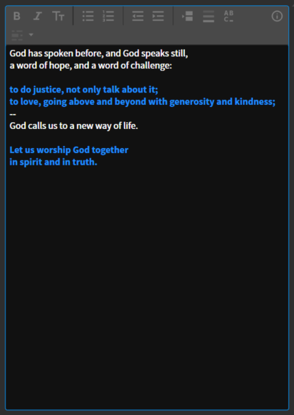
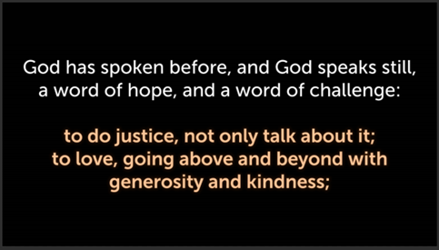
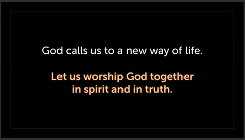

# Editing Text Content

## 1. Navigate to content to be edited
 To edit the previous liturgical elements/prayers navigate to the content you want to edit. They are all labelled on the left sidebar. When you select an element from the left sidebar it will turn yellow.
 
 
 

## 2. Copy and Paste
 From the liturgy worksheet or formatted liturgy, copy and paste the reading into the box on proclaim. <i>I will use the Gathering Words from 11/13/2022 as the example on this page.</i>

### C. Copy 

 

### B. Paste
 
 

## 3. Format
 It should keep the bold elements bold when you paste, but you’ll have to make them glow, so you can check their bolding then. The simple rule here is whatever is bolded in the liturgy (for the congregation to read together) gets bolded and emphasized in Proclaim. The text will show up blue in the text box when you emphasize it, and yellow on the slides. Also, center the content both horizontally and vertically.
 
### A. Bold
  Bold lines by using the following button:

  

### B. Emphasize
  Emphasize lines using the ```Empahsize Text``` button at the top of the text box:

  

### C. Slide Breaks
  Add slide breaks in one of two ways. You can add two dashes on its own line:

  ```
  --
  ```

  or using the ```Slide Break``` button:

  

### D. Center Content
  Verify that the content is vertically and horizontally centered on the slide. Do the following to verify this:

  On the top bar click the ```Text Alignment``` icon:

  

  Select the middle item in the list of nine (both vertically and horizontally centered):

  

### E. Example
  Doing all of this ends up with the following in the text box: <i>(Using the Gathering Words from 11/13/2022 as the example)</i>

  
  
  And the following look on the slides:

  
  