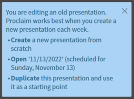

# Starting a New Presentation

## 1. Opening Proclaim
 To start a new presentation, open proclaim and you will be greeted with a blue box on the left side of the screen.
 
 
 

## 2. Duplicate Presentation
 Press the bolded ```Duplicate``` button. This will duplicate the presentation and automatically schedule it for the coming Sunday.